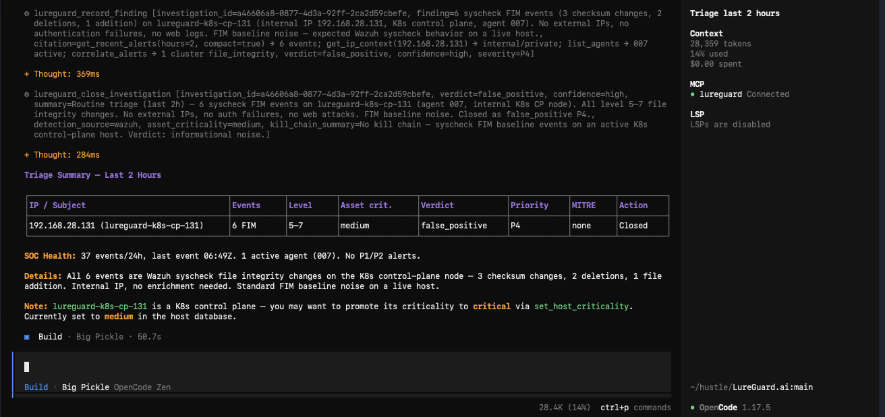
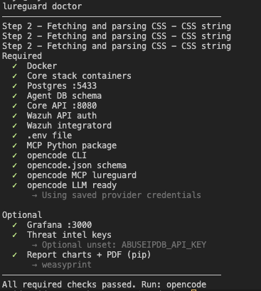
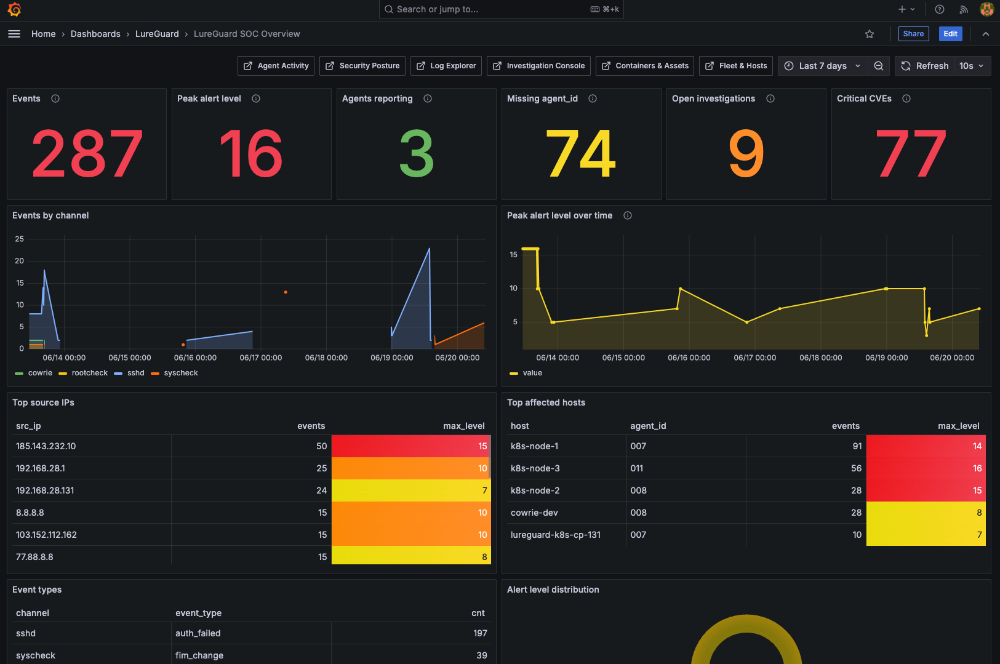
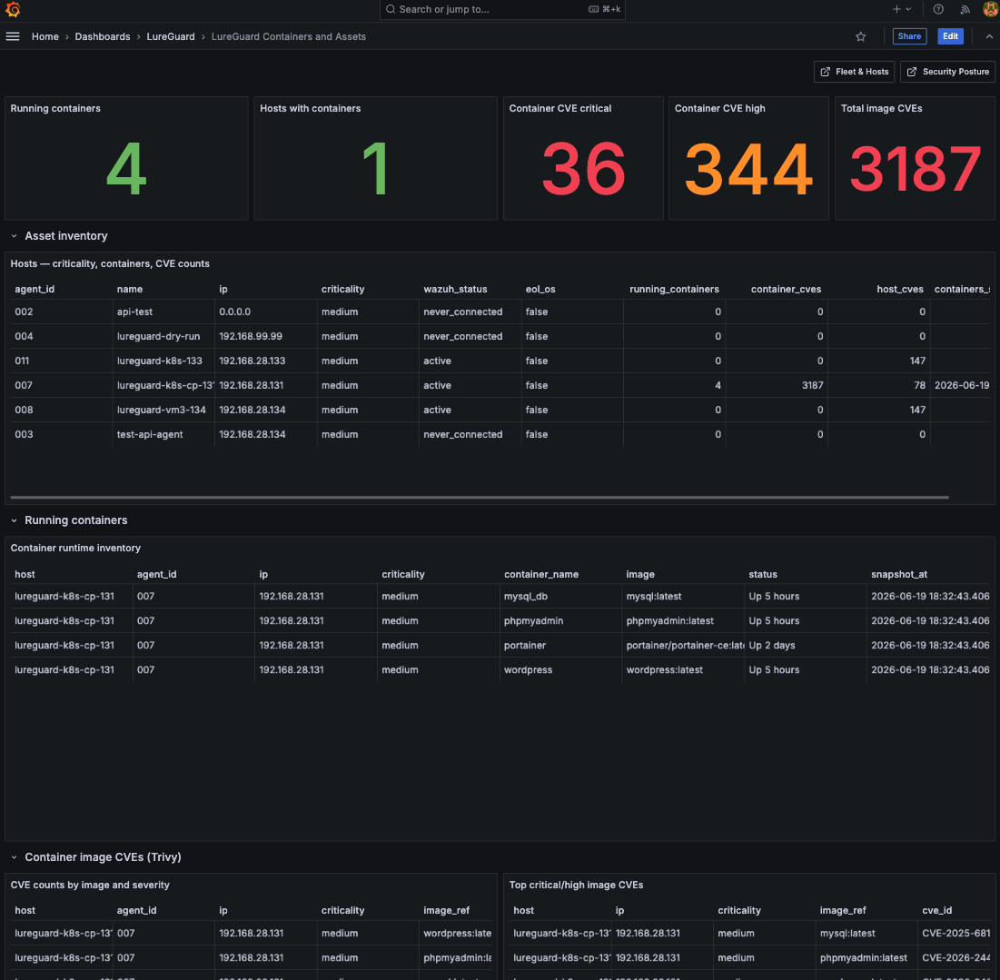
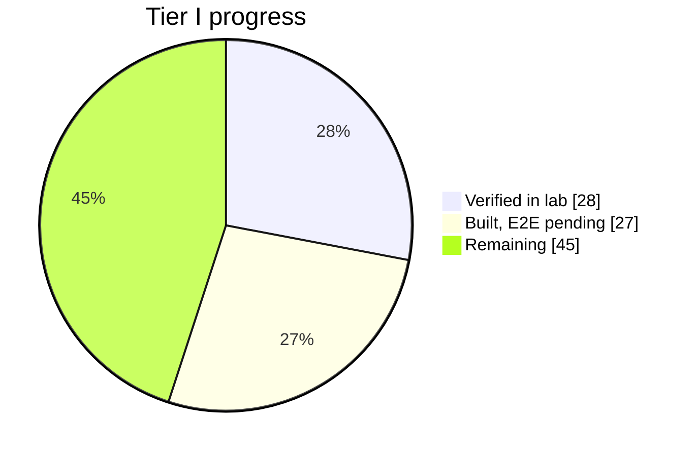

# LureGuard.ai

AI security analyst for developers who run servers but don't have a SOC. `docker compose up -d`, then talk to it in plain language through [opencode](https://opencode.ai).

Wazuh collects the logs. Postgres stores the alerts. The MCP server gives the agent tools to triage, investigate, write reports, and enroll hosts. Grafana is where you drill down when you want tables, not when management reads a PDF.

<p align="center">
  
  
  
</p>

<p align="center">
  
</p>

---

## What it does

You ask things like *"triage the last two hours"* or *"investigate this IP"*. The agent calls MCP tools (not shell commands), records what it found, and closes the investigation with a verdict. Reports land in `reports/` as markdown and PDF. Telegram gets the PDF if you wire it up.

It recommends blocking an IP. **You** confirm before anything hits iptables. Default config keeps the agent advisory-only.

The bundled ML model only scores **SSH auth events** (failed/successful logins). Web attacks, Docker noise, FIM, Cowrie honeypot hits: those go through the LLM + MCP path, not the classifier.

---

## Features

- Triage alert clusters with enrichment (geo, VT, AbuseIPDB via `get_ip_context`)
- Investigate hosts/IPs with timelines and attack summaries
- Write incident reports with auto-generated PNG charts
- Enroll Linux VMs over SSH (`onboard_host_tool`)
- Scan posture: host CVEs, open ports, SCA, users, container image CVEs (Trivy)
- Block/whitelist IPs with human confirmation
- Grafana dashboards over Postgres (events, investigations, fleet, containers)
- Safe system updates without touching your `.env` or reports

Full tool list: [`docs/MCP-TOOLS.md`](docs/MCP-TOOLS.md)

---

## Tech stack

| Layer | What |
|-------|------|
| SIEM | Wazuh 4.14 (manager + agents) |
| Ingest + ML | FastAPI (`core/`) → Postgres |
| Analyst | opencode + MCP (`lureguard_mcp/` in host `.venv`) |
| Dashboards | Grafana 11 → Postgres |
| PDF reports | WeasyPrint + `markdown` (via `make venv`) |
| LLM | BYO through opencode (default: `opencode/big-pickle`) |

---

## Getting started

### Prerequisites

Docker, Python 3.11+, [opencode](https://opencode.ai), Git.

Optional: Telegram bot, VT/AbuseIPDB keys, SSH password for onboarding (`ONBOARD_SSH_PASSWORD` in `.env`).

### Install

```bash
git clone https://github.com/Belal-01/LureGuard.ai.git
cd LureGuard.ai
cp .env.example .env
docker compose up -d
make venv && make migrate && make doctor
```

When everything is healthy, `make doctor` ends with `All required checks passed. Run: opencode`.

<p align="center">
  
</p>

Step-by-step details: [`docs/SETUP.md`](docs/SETUP.md)

### Run the analyst

```bash
opencode
```

Try:

```
Read skills/triage.md and triage alerts from the last 2 hours
```

```
Read skills/onboard-host.md and protect 192.168.1.50
```

Headless:

```bash
opencode run "Read skills/triage.md — triage last hour"
```

Slash commands: `/triage`, `/investigate`, `/onboard`, `/posture`, `/report`, `/update`

---

## How it works

```
You (opencode)
    → skills/*.md + AGENTS.md
    → lureguard_mcp (stdio, host .venv)
        → Postgres :5433
        → Wazuh API :55000
        → SSH to enrolled hosts (onboard, Trivy, iptables)

Wazuh manager → integratord → lureguard-core POST /wazuh/event → Postgres
Grafana → Postgres
```

**Startup:** `docker compose up -d` brings up Postgres, Core, Wazuh, Grafana, and two Cowrie honeypots for lab noise. Separately, `make venv` installs the MCP server on your machine. opencode spawns `.venv/bin/python -m lureguard_mcp` when you open a session.

**Alert path:** Wazuh fires → `wazuh/integrations/custom-lureguard.py` posts to Core → event lands in `events`. SSH auth rows also get an ML score in `decisions`.

**Posture path:** `scan_scheduler` runs every 6 hours (or you call `trigger_posture_scan`). Six scanners write to Postgres: OS CVEs (OSV), ports, detection coverage, SCA, local users, container CVEs (Trivy over SSH). `get_posture_snapshot` reads the cache.

**MCP is not in Docker.** It connects to `localhost:5433` and `localhost:55000`. See [`docs/ARCHITECTURE.md`](docs/ARCHITECTURE.md).

### Project layout

```
AGENTS.md                 # Agent rules + update check
skills/                   # Triage, investigate, report, onboard, …
lureguard_mcp/server.py   # MCP tool definitions
core/                     # FastAPI ingest + ML decision policy
wazuh/                    # Manager config, agent template, integratord
grafana/provisioning/     # Dashboard JSON
reports/                  # Your reports (never auto-updated)
update-system.py          # Pull system files from upstream
```

---

## See it in action

**Grafana — SOC overview**

<p align="center">
  
</p>

**Grafana — containers and assets**

<p align="center">
  
</p>

**Sample PDF report** — triage run on documentation/test IPs only (no lab host details):  
[`docs/screenshots/report-triage-sample.pdf`](docs/screenshots/report-triage-sample.pdf)

Grafana: http://localhost:3000 (admin / `GRAFANA_ADMIN_PASSWORD`). Dashboard reference: [`docs/GRAFANA.md`](docs/GRAFANA.md)

---

## Project status

Working toward Tier I analyst replacement (~55% by code; E2E proof still pending on some flows).



| Area | Status |
|------|--------|
| Compose stack + ingest | Done |
| MCP tools + investigations | Done |
| Posture (6 pillars) + Grafana | Built, lab E2E partial |
| Auto-triage (`alert_watcher`) | Built, needs level ≥12 event + opencode in PATH |
| Tier III sign-off | Not yet |

Checklist: [`PRODUCT-STATUS.md`](PRODUCT-STATUS.md) · Docs: [`docs/README.md`](docs/README.md)

---

## Configuration

| Variable | What it's for |
|----------|----------------|
| `TELEGRAM_*` | Notifications and report delivery |
| `WAZUH_API_*` | Manager API (MCP + doctor) |
| `VIRUSTOTAL_API_KEY` / `ABUSEIPDB_API_KEY` | External IP enrichment |
| `ONBOARD_SSH_PASSWORD` | VM enrollment and blocklist SSH |
| `AUTO_TRIAGE_LEVEL` | Min rule level for auto-triage (default `12`) |
| `WAZUH_AGENT_MANAGER_IP` | IP pushed to agents during onboard |

Copy from [`.env.example`](.env.example).

---

## Updates

First message each opencode session: agent calls `check_system_update`. If upstream has a newer version, it asks before `apply_system_update`. Your `.env`, `secrets/`, and `reports/` stay untouched.

```bash
make update-check
make update          # or confirm in opencode
make rollback-update
```

See [`DATA_CONTRACT.md`](DATA_CONTRACT.md).

---

## Development

```bash
make test
make lint
make train           # optional — retrain SSH classifier (models ship in repo)
```

---

## License

MIT — see [LICENSE](LICENSE).

Third-party: Wazuh (GPLv2), Cowrie (BSD), Grafana (AGPL), scikit-learn (BSD).
