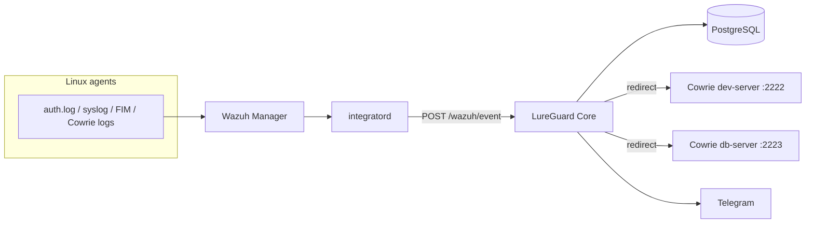

# LureGuard.ai

Host-level SIEM that ingests Wazuh alerts, scores SSH authentication with a pre-trained classifier, and redirects high-risk attackers to Cowrie honeypots via DNAT.

**Stack:** Wazuh 4.14 · FastAPI Core · PostgreSQL · Cowrie ×2 · scikit-learn (RandomForest, ~2 MB model in repo)

---

## What it does

1. **Wazuh Agent** on Linux targets collects `auth.log`, syslog, FIM, rootcheck, and Cowrie JSON.
2. **Wazuh Manager** applies rules and forwards matching alerts to Core through **integratord**.
3. **LureGuard Core** normalizes events, stores them in Postgres, runs ML inference, and applies a three-way policy:
   - **Allow** — log only  
   - **Alert** — Telegram notification  
   - **Redirect** — Telegram + iptables DNAT to a Cowrie profile (`dev-server` :2222 or `db-server` :2223)

FIM and rootcheck events are stored and can trigger Telegram when rule level ≥ 7. Full multi-channel ML scoring is on the roadmap; production path today is **SSH brute-force / auth** on Linux agents.

---

## Architecture



| Service | Port (host) | Role |
|---------|-------------|------|
| `lureguard-core` | 8080 | API, ML, policy, enforcement |
| `postgres` | 5433 | Events, decisions, whitelist |
| `wazuh-manager` | 1514 / 1515 | Agent comms + registration |
| `cowrie-dev` | 2222 | Honeypot profile `dev-server` |
| `cowrie-db` | 2223 | Honeypot profile `db-server` |

---

## Prerequisites

- **Docker** and Docker Compose v2 (Desktop on macOS/Windows; native on Linux)
- **Python 3.11+** for local dev (`make venv`, tests, optional retrain)
- **Linux lab VM** (optional) for a real Wazuh agent — see [`install.sh`](install.sh) and [`wazuh/wazuh-setup.md`](wazuh/wazuh-setup.md)
- **Telegram** bot token + chat ID (optional; alerts are skipped if unset)

---

## Quick start (Docker)

```bash
git clone <repo-url> && cd LureGuard.ai

cp .env.example .env
# Edit .env: TELEGRAM_BOT_TOKEN, TELEGRAM_CHAT_ID (recommended)

docker compose build
docker compose up -d
```

Verify:

```bash
curl -s http://localhost:8080/health
# {"status":"ok","service":"lureguard-core"}

docker exec wazuh-manager /var/ossec/bin/wazuh-control status | grep wazuh-db
```

**ML model:** `ml/models/model.joblib` and `scaler.joblib` are committed (~2 MB total). No training step is required for a standard clone.

### Enroll a Linux agent (lab)

On your machine (repo root):

```bash
./install.sh
```

Interactive script: Wazuh Manager (via Compose), secrets under `secrets/`, agent install on an Ubuntu VM, and integratord smoke test. For manual steps, see [`wazuh/wazuh-setup.md`](wazuh/wazuh-setup.md).

### Trigger a test alert

From another host, fail SSH login to the agent VM several times (integratord forwards to Core), or run the integration test against a live Core:

```bash
make core    # terminal 1
make test    # or: pytest tests/test_send_event.py -v -m integration
```

Watch Core logs: `docker logs -f lureguard-core`

---

## Configuration

| File | Purpose |
|------|---------|
| [`.env`](.env.example) | DB URL, Telegram, paths (`CONFIG_PATH`, `MODELS_DIR`) |
| [`config/core.yaml`](config/core.yaml) | T1/T2 thresholds, Cowrie profiles, policy gates |
| [`wazuh/ossec.conf`](wazuh/ossec.conf) | integratord hook URL and alert **group** filter |
| [`wazuh/agent-ossec.conf`](wazuh/agent-ossec.conf) | Agent log sources (template for lab VMs) |
| `secrets/` | `db_password.txt`, `admin_token.txt` (created by `install.sh`, gitignored) |

Default decision thresholds (`config/core.yaml`):

- **T1** = 0.55 — below → Allow  
- **T2** = 0.85 — between T1 and T2 → Alert; above → Redirect  
- **min_attempts_for_alert** = 8 — dampens single typo logins on the SSH feature window  

Admin API (Bearer token from `secrets/admin_token.txt` or `dev-token` in dev):

| Method | Path | Description |
|--------|------|-------------|
| GET/PUT | `/config/thresholds` | Read/update T1, T2 |
| GET/POST/DELETE | `/config/whitelist` | Trusted IPs (Postgres-backed) |
| POST | `/config/panic-flush` | Clear active DNAT rules |
| POST | `/config/reset-feature-window` | Clear in-memory SSH counters |
| GET | `/metrics` | Prometheus exposition (partial wiring) |
| GET | `/docs` | OpenAPI (Swagger) |

---

## Development

```bash
make venv          # .venv + pip install -e ".[dev,train]"
make ensure-ml     # verify model.joblib present
make test          # unit tests (excludes live Core integration)
make lint          # ruff + mypy (optional)
make core          # Postgres in Docker + uvicorn on :8080 with reload
```

| Target | Description |
|--------|-------------|
| `make up` / `make down` | Docker Compose stack |
| `make train` | Retrain on Kaggle data (auto-download via `kagglehub`) |
| `make fetch-dataset` | Download CSV only |
| `make train-full` | Full ~2.6M-row training (slow) |

Training data is **not** in Git. See [`ml/datasets/README.md`](ml/datasets/README.md).

---

## Machine learning

| Artifact | Size | In Git |
|----------|------|--------|
| `ml/models/model.joblib` | ~2.0 MB | Yes |
| `ml/models/scaler.joblib` | ~2 KB | Yes |
| `ml/models/model_registry.json` | ~1 KB | Yes (SHA-256, metrics) |

Classifier: **RandomForest** on 24 Wazuh alert features (`ml/alert_features.py`). Inference runs in-process at startup with registry hash verification.

Retrain only when changing features or refreshing public datasets:

```bash
make train
```

---

## Project layout

```
├── core/              # FastAPI app (collector, policy, inference, enforcer)
├── ml/                # Training, features, shipped model artifacts
├── wazuh/             # Manager config, integratord, custom rules
├── cowrie/            # Per-profile honeypot config
├── config/            # core.yaml
├── tests/
├── docker-compose.yml
├── Makefile
└── install.sh         # Lab Wazuh agent bootstrap
```

---

## Security notes

- Do **not** commit `.env` or `secrets/`.
- Change default admin token before any exposed deployment.
- Core container requires `NET_ADMIN` for iptables DNAT.
- Cowrie and Wazuh manager ports should stay on lab/management networks in production.
- Customer/production traffic must **not** be used to retrain models (`training_policy` in registry).

---

## Team

| Member | Area |
|--------|------|
| Majd | Core, DB, enforcement, Wazuh Manager, deployment |
| Ali | Data pipeline, features, Grafana |
| Jalal | ML training & evaluation |
| Belal | Wazuh agent, Cowrie, BYOLLM, Telegram |

---

## Known limitations

- **Policy scope:** ML + redirect applies to SSH auth events; syslog, Apache, and Windows channels are collected in places but not fully scored or redirected.
- **integratord filter:** Only alert groups listed in `wazuh/ossec.conf` reach Core (auth, FIM, rootcheck, `lureguard_custom` / Cowrie).
- **LLM layer:** `core/modules/llm_abstraction.py` is a stub (Sprint 3).
- **Metrics:** `/metrics` exists; full Prometheus wiring across the pipeline is incomplete.
- **Grafana dashboards:** planned (Ali).

---

## License

This project is licensed under the [MIT License](LICENSE).

Bundled or integrated third-party software (Wazuh, Cowrie, scikit-learn, etc.) remains under their respective licenses.

## Third-party

[Wazuh](https://wazuh.com/) · [Cowrie](https://github.com/cowrie/cowrie) · scikit-learn
