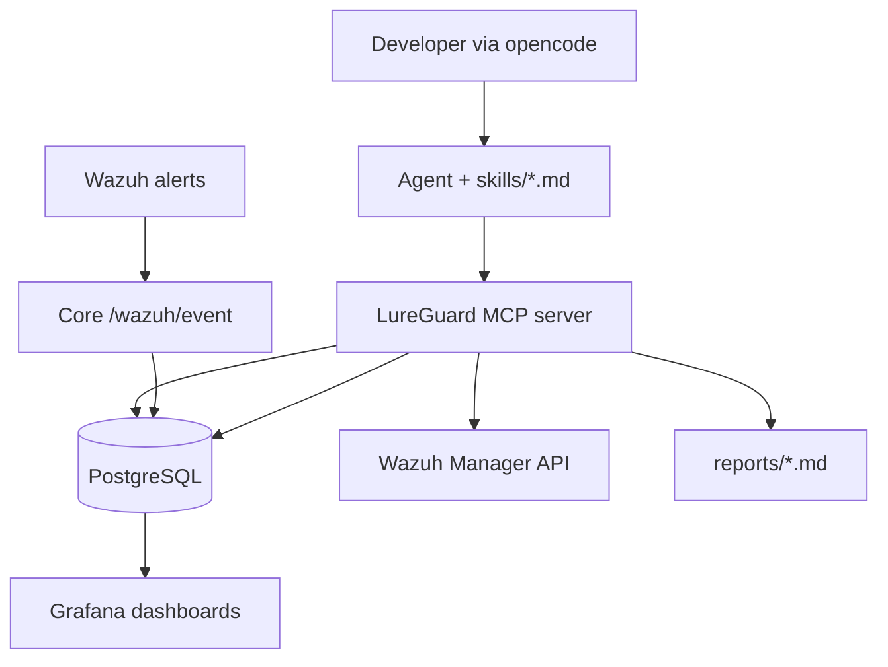

# LureGuard.ai

**Plug-and-play AI security analyst for developers.** One `docker compose up -d`. Wazuh is the embedded SIEM engine. Talk to it in plain language via [opencode](https://opencode.ai); it triages alerts, investigates hosts, writes reports, and enrolls agents — with every action logged to Postgres and shown in Grafana.

> *An AI-augmented SOC for people who don't have a SOC.*

**Stack:** Wazuh 4.14 · FastAPI Core · PostgreSQL · Grafana · MCP · opencode (BYO-LLM)

> **Product status checklist:** see [`PRODUCT-STATUS.md`](PRODUCT-STATUS.md) for use cases, verification status (what is proven vs code-only), and Tier I gate.

---

## What's new (Tier 1 investigation quality — June 2026)

| Area | Tools / files |
|------|----------------|
| **Richer events** | `wazuh_rule_description`, geo on events; `decisions.event_id` → ML score in timeline (SSH auth only) |
| **Mandatory enrichment** | `get_ip_context` — geo + AbuseIPDB + VirusTotal + verdict in one call |
| **Attack narrative** | `get_event_timeline`, `get_attack_summary` — duration, phases, top rules, honeypot contact |
| **IP blocking** | `recommend_block_ip`, `confirm_block_ip`, `list_blocklist` — human-confirmed iptables |
| **Always-on triage** | `alert_watcher.py` + `AUTO_TRIAGE_LEVEL=12` |
| **Log coverage** | Web/docker/apache/nginx groups + generic Docker stdout in `wazuh/agent-ossec.conf` |
| **Container CVEs** | `scan_container_image`, `get_container_vulnerabilities` (Trivy via SSH) |
| **Asset criticality** | `set_host_criticality`, `onboard_host_tool(..., criticality=)` |
| **SLA metrics** | `get_soc_health` → MTTD, MTTR, FPR; Grafana SLA panels |
| **TLS + firewall** | `check_tls`, `get_agent_exposure` → `firewall_rules` |

Run `make migrate` after pull (migration `h8i9j0k1l2m3_investigation_quality`).

**Proof status:** code + **101 unit tests** pass locally; full opencode triage/investigate/block E2E is documented in [`PRODUCT-STATUS.md` §0](PRODUCT-STATUS.md) — run together before trusting in production.

---

## What it does

1. **Wazuh** collects logs from Linux agents (SSH, FIM, syslog, **Docker container stdout**, web server logs) and forwards alerts to Core.
2. **Core** stores events in Postgres, runs the SSH ML classifier, and links decisions to events via `event_id`.
3. **You** run `opencode` and ask in plain language: *"triage the last hour"*, *"investigate 203.0.113.5"*, *"protect my VM at 192.168.1.50"*.
4. **LureGuard MCP server** gives the AI tools: enriched timelines, compound IP context (AbuseIPDB + VT + geo), attack summaries, block recommendations, container CVE scans, posture, reports, onboarding.
5. **Grafana** shows SIEM events, attack timeline with ML scores, SLA metrics, investigations, and fleet status.
6. **`alert_watcher`** (optional, starts with MCP server) polls for high-severity events (default level ≥ 12) and can trigger headless auto-triage.

**Trust posture:** Tier-2 brains, Tier-1 hands — advisory only. The agent recommends blocks via `recommend_block_ip`; **you** must call `confirm_block_ip` to apply iptables. The agent never blocks autonomously.

---

## Architecture



| Service | Port | Role |
|---------|------|------|
| `lureguard-core` | 8080 | Wazuh webhook ingest, scheduler |
| `postgres` | 5433 | Events, investigations, agent audit log |
| `wazuh-manager` | 1514/1515/55000 | SIEM + Manager API |
| `grafana` | 3000 | SOC + Agent Activity + Fleet dashboards |
| MCP (host) | stdio | opencode tool bridge |

---

## Quick start

```bash
git clone <repo-url> && cd LureGuard.ai

cp .env.example .env
# Edit: TELEGRAM_BOT_TOKEN, TELEGRAM_CHAT_ID (optional)
# Optional: VIRUSTOTAL_API_KEY, ABUSEIPDB_API_KEY, ONBOARD_SSH_PASSWORD

docker compose up -d
make venv          # installs .[mcp] for MCP + doctor
make doctor        # verify stack + opencode config/MCP
opencode           # uses free opencode/big-pickle by default (no API key)
```

**First prompts to try:**

```
Read skills/triage.md and triage alerts from the last 2 hours
```

```
Read skills/investigate-host.md and investigate 10.0.0.5
```

```
Read skills/onboard-host.md and protect 192.168.1.100 (ubuntu user)
```

Headless:

```bash
opencode run "Read AGENTS.md and skills/triage.md — triage last hour"
```

---

## Doctor

Like career-ops `npm run doctor`:

```bash
make doctor
```

Checks Docker services, Postgres schema, Core health, Wazuh API, integratord hook, Grafana, `.env`, opencode + MCP imports.

### Verify investigation features (local smoke)

```bash
make migrate && make test          # 101 tests; applies h8i9j0k1l2m3 migration

# Ingestion + SLA
.venv/bin/python -c "from lureguard_mcp.db import get_soc_health_db; import json; print(json.dumps(get_soc_health_db(), indent=2))"

# Rich timeline (replace IP with src_ip from alerts)
.venv/bin/python -c "
from lureguard_mcp.db import get_attack_summary, get_event_timeline
import json
ip = '127.0.0.1'
print(json.dumps(get_attack_summary(ip), indent=2))
"

# External IP enrichment (needs VIRUSTOTAL_API_KEY / ABUSEIPDB_API_KEY in .env)
.venv/bin/python -c "from lureguard_mcp.enrichment import get_ip_context; print(get_ip_context('8.8.8.8'))"
```

Full E2E (you + opencode): triage → investigate → optional `recommend_block_ip` — see [`PRODUCT-STATUS.md` §0](PRODUCT-STATUS.md).

---

## Grafana

Open http://localhost:3000 (admin / password from `.env`).

| Dashboard | Shows |
|-----------|--------|
| **LureGuard SOC Overview** | Events, alert levels, top IPs, posture stats, **SLA (MTTD/MTTR/FPR/pending blocks)** |
| **LureGuard Agent Activity** | Investigations, verdicts, tool calls, **attack timeline + ML scores** |
| **LureGuard Fleet and Hosts** | Enrolled agents, Wazuh status, criticality |
| **LureGuard Security Posture** | CVE, exposure, detection, SCA, users, EPSS |

---

## Flagship demo (for evaluators)

```bash
# 1. Stack up
docker compose up -d && make doctor

# 2. Onboard a lab VM (set ONBOARD_SSH_PASSWORD in .env)
opencode
> Read skills/onboard-host.md and onboard 192.168.1.50

# 3. Generate noise (from another machine)
ssh baduser@192.168.1.50   # failed logins → Wazuh alerts

# 4. Triage + report
> Read skills/triage.md and triage the last 30 minutes
> Read skills/incident-report.md and write a report for the top alert

# 5. Show Grafana Agent Activity + Fleet dashboards
```

---

## Project layout

```
AGENTS.md              # Agent constitution + MCP tool summary
skills/                # Mode playbooks (triage, investigate, report, …)
lureguard_mcp/         # MCP server, alert_watcher, blocklist, container_scanner
.opencode/command/     # triage, investigate, onboard, posture, report, auto-triage
opencode.json          # MCP wiring for opencode
core/                  # FastAPI ingest + ML decision pipeline
wazuh/                 # Manager config, integratord, agent template (docker logs)
grafana/provisioning/  # Dashboards (Postgres datasource)
reports/               # Generated incident reports (+ assets/*.png charts)
migrations/            # Alembic — run `make migrate` after pull
```

**Reports:** `save_report` auto-embeds PNG charts in a `## Visual summary` section. PDF uses **WeasyPrint** (via `make venv`) for proper tables and chart images; xhtml2pdf is a fallback. Telegram delivery sends PDF by default.

---

## Configuration

| Variable | Purpose |
|----------|---------|
| `TELEGRAM_*` | Alert notifications + auto-triage pings |
| `WAZUH_API_*` | Manager API for MCP (default dev credentials in `.env.example`) |
| `VIRUSTOTAL_API_KEY` | `get_ip_context`, hash/URL/domain checks |
| `ABUSEIPDB_API_KEY` | `get_ip_context`, IP reputation |
| `ONBOARD_SSH_PASSWORD` | VM enrollment + iptables block execution |
| `AUTO_TRIAGE_LEVEL` | Min Wazuh rule level for `alert_watcher` (default `12`) |
| `WAZUH_AGENT_MANAGER_IP` | Override manager IP pushed to agents during onboard |

---

## Development

```bash
make venv
make test              # 101 unit tests (investigation quality, collector, ML, posture)
make lint
make migrate          # required after pull — includes h8i9j0k1l2m3
make db-revision m="description"
make train            # optional — retrain SSH classifier (models ship in repo)
```

---

## License

MIT — see [LICENSE](LICENSE).

## Third-party

Wazuh (GPLv2), Cowrie (BSD), Grafana (AGPL), scikit-learn (BSD).
