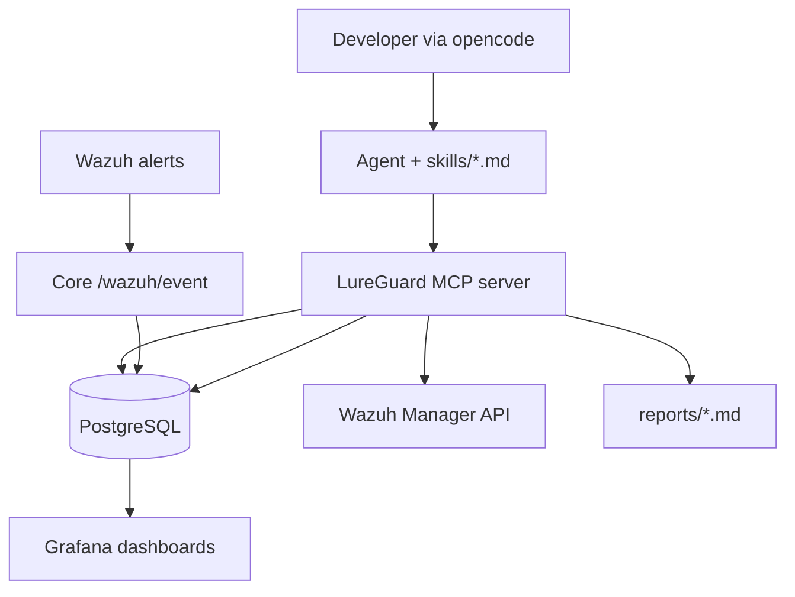

# LureGuard.ai

**Plug-and-play AI security analyst for developers.** One `docker compose up -d`. Wazuh is the embedded SIEM engine. Talk to it in plain language via [opencode](https://opencode.ai); it triages alerts, investigates hosts, writes reports, and enrolls agents — with every action logged to Postgres and shown in Grafana.

> *An AI-augmented SOC for people who don't have a SOC.*

**Stack:** Wazuh 4.14 · FastAPI Core · PostgreSQL · Grafana · MCP · opencode (BYO-LLM)

> **Product status checklist:** see [`PRODUCT-STATUS.md`](PRODUCT-STATUS.md) for end-to-end use cases, what's done, blockers, and Tier I replacement gate.

---

## What it does

1. **Wazuh** collects logs from Linux agents (SSH, FIM, syslog) and forwards alerts to Core.
2. **Core** stores events in Postgres (no `.log` files for the agent layer).
3. **You** run `opencode` and ask in plain language: *"triage the last hour"*, *"investigate 203.0.113.5"*, *"protect my VM at 192.168.1.50"*.
4. **LureGuard MCP server** gives the AI tools: query alerts, enrich IOCs, inspect Wazuh agents, write reports, onboard hosts via SSH.
5. **Grafana** shows SIEM events, agent investigations, tool-call audit trail, and fleet status.

**Trust posture:** Tier-2 brains, Tier-1 hands — advisory only. The agent never blocks, isolates, or changes firewall rules without you.

---

## Architecture



| Service | Port | Role |
|---------|------|------|
| `lureguard-core` | 8080 | Wazuh webhook ingest, scheduler |
| `postgres` | 5433 | Events, investigations, agent audit log |
| `wazuh-manager` | 1514/1515/55000 | SIEM + Manager API |
| `grafana` | 3000 | SOC + Agent Activity + Fleet dashboards |
| MCP (host) | stdio | opencode tool bridge |

---

## Quick start

```bash
git clone <repo-url> && cd LureGuard.ai

cp .env.example .env
# Edit: TELEGRAM_BOT_TOKEN, TELEGRAM_CHAT_ID (optional)
# Optional: VIRUSTOTAL_API_KEY, ABUSEIPDB_API_KEY, ONBOARD_SSH_PASSWORD

docker compose up -d
make venv          # installs .[mcp] for MCP + doctor
make doctor        # verify stack + opencode config/MCP
opencode           # uses free opencode/big-pickle by default (no API key)
```

**First prompts to try:**

```
Read skills/triage.md and triage alerts from the last 2 hours
```

```
Read skills/investigate-host.md and investigate 10.0.0.5
```

```
Read skills/onboard-host.md and protect 192.168.1.100 (ubuntu user)
```

Headless:

```bash
opencode run "Read AGENTS.md and skills/triage.md — triage last hour"
```

---

## Doctor

Like career-ops `npm run doctor`:

```bash
make doctor
```

Checks Docker services, Postgres schema, Core health, Wazuh API, integratord hook, Grafana, `.env`, opencode + MCP imports.

---

## Grafana

Open http://localhost:3000 (admin / password from `.env`).

| Dashboard | Shows |
|-----------|--------|
| **LureGuard SOC Overview** | Events by channel, alert levels, top IPs |
| **LureGuard Agent Activity** | Investigations, verdicts, tool calls, reports |
| **LureGuard Fleet and Hosts** | Enrolled agents, Wazuh status |

---

## Flagship demo (for evaluators)

```bash
# 1. Stack up
docker compose up -d && make doctor

# 2. Onboard a lab VM (set ONBOARD_SSH_PASSWORD in .env)
opencode
> Read skills/onboard-host.md and onboard 192.168.1.50

# 3. Generate noise (from another machine)
ssh baduser@192.168.1.50   # failed logins → Wazuh alerts

# 4. Triage + report
> Read skills/triage.md and triage the last 30 minutes
> Read skills/incident-report.md and write a report for the top alert

# 5. Show Grafana Agent Activity + Fleet dashboards
```

---

## Project layout

```
AGENTS.md              # Agent constitution
skills/                # Mode playbooks (triage, investigate, report, …)
lureguard_mcp/         # MCP server + doctor
opencode.json          # MCP wiring for opencode
core/                  # FastAPI ingest + scheduler
wazuh/                 # Manager config, integratord, agent template
grafana/provisioning/  # Dashboards (Postgres datasource)
reports/               # Generated incident reports
```

---

## Configuration

| Variable | Purpose |
|----------|---------|
| `TELEGRAM_*` | Alert notifications |
| `WAZUH_API_*` | Manager API for MCP (default `wazuh:wazuh`) |
| `VIRUSTOTAL_API_KEY` | Optional IOC enrichment |
| `ABUSEIPDB_API_KEY` | Optional IP reputation |
| `ONBOARD_SSH_PASSWORD` | VM enrollment via MCP |

---

## Development

```bash
make venv
make test
make lint
make migrate          # after schema changes
make db-revision m="description"   # create new migration
make train            # optional — retrain SSH classifier (models ship in repo)
```

---

## License

MIT — see [LICENSE](LICENSE).

## Third-party

Wazuh (GPLv2), Cowrie (BSD), Grafana (AGPL), scikit-learn (BSD).
